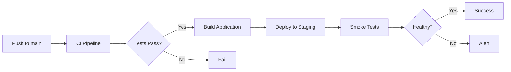
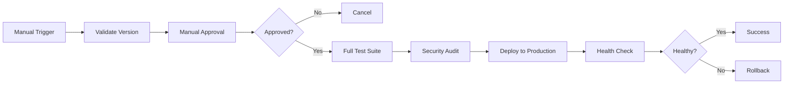

# CI/CD Pipeline Documentation

## Overview

This document describes the CI/CD pipeline for the Communication Tool (Lark Message Hub) project.

## Architecture

```
┌─────────────────────────────────────────────────────────────────┐
│                        CI/CD Pipeline                            │
├─────────────────────────────────────────────────────────────────┤
│                                                                  │
│  Code Push → CI Pipeline → Deploy Staging → Deploy Production   │
│                                                                  │
│     ↓            ↓              ↓                  ↓             │
│  Lint       Test         Health Check      Manual Approval      │
│  Build      Coverage     Smoke Tests       Rollback Ready       │
│  Security   Artifacts                                           │
│                                                                  │
└─────────────────────────────────────────────────────────────────┘
```

## Workflows

### 1. CI Pipeline (`ci.yml`)

**Trigger**: Push or Pull Request to main, develop, or feature branches

**Jobs**:
- **Lint**: ESLint + TypeScript type checking
- **Test**: Run tests with coverage reporting
- **Build**: Compile TypeScript and verify output
- **Security Scan**: npm audit + Snyk scanning

**Environment Variables Required**:
```bash
CODECOV_TOKEN     # Optional: For coverage reporting
SNYK_TOKEN        # Optional: For security scanning
```

**Usage**:
```bash
# Automatically runs on push/PR
git push origin feature/my-feature
```

### 2. Deploy to Staging (`deploy-staging.yml`)

**Trigger**: Push to main branch or manual dispatch

**Jobs**:
1. Pre-deployment checks (tests, build)
2. Deploy infrastructure using AWS SAM
3. Run smoke tests
4. Post-deployment tasks

**Environment Variables Required**:
```bash
AWS_ROLE_ARN_STAGING              # AWS IAM role for staging
SAM_DEPLOYMENT_BUCKET_STAGING     # S3 bucket for SAM artifacts
```

**Manual Deployment**:
```bash
# Via npm script
npm run deploy:staging

# Via GitHub Actions UI
Actions → Deploy to Staging → Run workflow
```

### 3. Deploy to Production (`deploy-production.yml`)

**Trigger**: Manual workflow dispatch only

**Jobs**:
1. Validation (version format check)
2. **Manual Approval** (required unless --skip-approval)
3. Pre-deployment checks (full test suite + security audit)
4. Deploy to production
5. Health checks
6. Rollback on failure
7. Post-deployment tasks

**Environment Variables Required**:
```bash
AWS_ROLE_ARN_PRODUCTION              # AWS IAM role for production
SAM_DEPLOYMENT_BUCKET_PRODUCTION     # S3 bucket for SAM artifacts
```

**Manual Deployment**:
```bash
# Via npm script
npm run deploy:production

# Via GitHub Actions UI
Actions → Deploy to Production → Run workflow
  - Version: v1.0.0
  - Skip approval: false (recommended)
```

### 4. Infrastructure Deployment (`infrastructure.yml`)

**Trigger**:
- Push to main (changes to template.yaml or infrastructure/*)
- Pull Request (preview changes)
- Manual workflow dispatch

**Jobs**:
- **Validate**: CloudFormation template validation
- **Preview**: Generate changeset (on PR)
- **Deploy Staging**: Deploy infrastructure changes to staging
- **Deploy Production**: Deploy infrastructure changes to production (manual)
- **Delete Stack**: Remove infrastructure (manual, requires approval)

**Usage**:
```bash
# Validate template
sam validate --lint

# Preview changes (dry-run)
npm run deploy:preview

# Deploy infrastructure manually
Actions → Infrastructure Deployment → Run workflow
  - Environment: staging/production
  - Action: deploy/validate/preview/delete
```

## Environment Setup

### 1. AWS Configuration

#### Required IAM Roles

**Staging Role** (`AWS_ROLE_ARN_STAGING`):
```json
{
  "Version": "2012-10-17",
  "Statement": [
    {
      "Effect": "Allow",
      "Action": [
        "cloudformation:*",
        "lambda:*",
        "apigateway:*",
        "dynamodb:*",
        "logs:*",
        "s3:*",
        "iam:PassRole",
        "secretsmanager:GetSecretValue"
      ],
      "Resource": "*"
    }
  ]
}
```

**Production Role** (`AWS_ROLE_ARN_PRODUCTION`):
Same as staging, but with additional safeguards and logging.

#### Required S3 Buckets

Create S3 buckets for SAM deployments:
```bash
# Staging
aws s3 mb s3://communication-tool-sam-staging

# Production
aws s3 mb s3://communication-tool-sam-production
```

### 2. GitHub Secrets Configuration

Navigate to: `Settings → Secrets and variables → Actions`

**Required Secrets**:
```bash
# AWS Credentials (Staging)
AWS_ROLE_ARN_STAGING=arn:aws:iam::123456789012:role/GitHubActions-Staging
SAM_DEPLOYMENT_BUCKET_STAGING=communication-tool-sam-staging

# AWS Credentials (Production)
AWS_ROLE_ARN_PRODUCTION=arn:aws:iam::123456789012:role/GitHubActions-Production
SAM_DEPLOYMENT_BUCKET_PRODUCTION=communication-tool-sam-production

# Optional - External Services
CODECOV_TOKEN=...           # Code coverage reporting
SNYK_TOKEN=...             # Security scanning
```

### 3. Environment Variables

Set these in GitHub Environments:

**Staging Environment**:
```
STAGING_ENDPOINT_URL=https://api-staging.example.com
NODE_ENV=staging
```

**Production Environment**:
```
PRODUCTION_ENDPOINT_URL=https://api.example.com
NODE_ENV=production
```

## Deployment Scripts

### 1. deploy.sh

Main deployment helper script with comprehensive options.

**Usage**:
```bash
# Deploy to staging
./scripts/deploy.sh staging

# Deploy to staging (auto-approve, skip tests)
./scripts/deploy.sh staging --auto-approve --skip-tests

# Preview production deployment
./scripts/deploy.sh production --dry-run

# Verbose output
./scripts/deploy.sh staging --verbose
```

**Options**:
- `--skip-tests`: Skip test execution
- `--skip-build`: Skip build step
- `--dry-run`: Preview changes without deploying
- `--auto-approve`: Skip manual approval (staging only)
- `--verbose`: Enable verbose output

### 2. smoke-tests.sh

Runs smoke tests against deployed endpoints.

**Usage**:
```bash
# Run smoke tests
./scripts/smoke-tests.sh https://api.example.com/staging

# Via npm
npm run smoke:staging
```

**Tests**:
- Health check endpoint
- API reachability
- Response time check
- SSL certificate validation
- CORS headers

### 3. health-check.sh

Comprehensive health check with retries.

**Usage**:
```bash
# Run health check
./scripts/health-check.sh https://api.example.com/production

# Via npm
npm run health:production
```

**Features**:
- 5 retry attempts with exponential backoff
- CloudWatch metrics check
- API version verification
- Detailed failure reporting

## Deployment Workflows

### Staging Deployment



**Steps**:
1. Push changes to main branch
2. CI pipeline runs automatically
3. If CI passes, staging deployment starts
4. Infrastructure deployed via SAM
5. Smoke tests verify deployment
6. Success notification

### Production Deployment



**Steps**:
1. Trigger workflow from GitHub Actions UI
2. Specify version (e.g., v1.0.0)
3. **Wait for manual approval** (required)
4. Full test suite + security audit runs
5. Deploy to production
6. Health checks verify deployment
7. Automatic rollback on failure

## NPM Scripts Reference

```bash
# Development
npm run dev              # Start development server
npm run build            # Build TypeScript
npm test                 # Run tests
npm run lint             # Lint code
npm run typecheck        # Type check

# Deployment
npm run deploy:staging            # Deploy to staging
npm run deploy:staging:quick      # Deploy to staging (auto-approve)
npm run deploy:production         # Deploy to production
npm run deploy:preview            # Preview staging deployment

# Health & Testing
npm run health:staging            # Check staging health
npm run health:production         # Check production health
npm run smoke:staging             # Run staging smoke tests
npm run smoke:production          # Run production smoke tests
```

## Monitoring & Alerts

### CloudWatch Alarms

The infrastructure creates the following alarms:

1. **API Gateway 5xx Errors**
   - Threshold: 5 errors in 5 minutes
   - Action: Alert via SNS (configure in template)

2. **Lambda Errors**
   - Threshold: 3 errors in 5 minutes
   - Action: Alert via SNS

3. **Lambda Throttles**
   - Threshold: 1 throttle in 5 minutes
   - Action: Alert via SNS

### Metrics to Monitor

- API Gateway latency
- Lambda duration
- DynamoDB read/write capacity
- Error rates
- Throttle rates

### Log Groups

All logs are centralized in CloudWatch:
- `/aws/apigateway/communication-tool-{environment}`
- `/aws/lambda/communication-tool-main-{environment}`
- `/aws/lambda/communication-tool-health-{environment}`

## Rollback Procedures

### Automatic Rollback

Production deployment automatically triggers rollback if:
- Health checks fail after deployment
- Smoke tests fail

### Manual Rollback

**Option 1: Redeploy Previous Version**
```bash
# Trigger deployment with previous version
Actions → Deploy to Production → Run workflow
  Version: v0.9.0  # Previous stable version
```

**Option 2: CloudFormation Rollback**
```bash
# Via AWS CLI
aws cloudformation cancel-update-stack \
  --stack-name communication-tool-production

# Or rollback to previous template
aws cloudformation update-stack \
  --stack-name communication-tool-production \
  --use-previous-template
```

## Troubleshooting

### Common Issues

**1. CI Pipeline Fails**
```bash
# Check logs in GitHub Actions
# Fix issues locally
npm run lint
npm test
npm run build
```

**2. Deployment Fails - Invalid Template**
```bash
# Validate template locally
sam validate --lint

# Check CloudFormation events
aws cloudformation describe-stack-events \
  --stack-name communication-tool-staging
```

**3. Health Check Fails**
```bash
# Check Lambda logs
aws logs tail /aws/lambda/communication-tool-main-staging --follow

# Check API Gateway
aws apigateway get-rest-apis

# Manual health check
curl https://your-endpoint.amazonaws.com/health
```

**4. Permission Denied**
```bash
# Verify IAM role permissions
aws iam get-role --role-name GitHubActions-Staging

# Verify role trust relationship
aws iam get-role-policy --role-name GitHubActions-Staging
```

### Debug Mode

Enable verbose logging:
```bash
# In deploy.sh
./scripts/deploy.sh staging --verbose

# In GitHub Actions
# Edit workflow and add:
env:
  ACTIONS_STEP_DEBUG: true
```

## Best Practices

1. **Always run CI before deploying**
   - Ensure all tests pass
   - Fix linting errors
   - Review security scan results

2. **Use staging environment first**
   - Test all changes in staging
   - Verify functionality
   - Monitor for issues

3. **Production deployments**
   - Always use semantic versioning (v1.2.3)
   - Never skip approval
   - Monitor metrics after deployment
   - Have rollback plan ready

4. **Security**
   - Rotate AWS credentials regularly
   - Review IAM permissions quarterly
   - Keep dependencies updated
   - Monitor security scan results

5. **Monitoring**
   - Set up CloudWatch dashboards
   - Configure SNS alerts
   - Review logs regularly
   - Track key metrics

## Support

For issues or questions:
1. Check GitHub Actions logs
2. Review CloudWatch logs
3. Consult this documentation
4. Create an issue in the repository

## License

MIT
